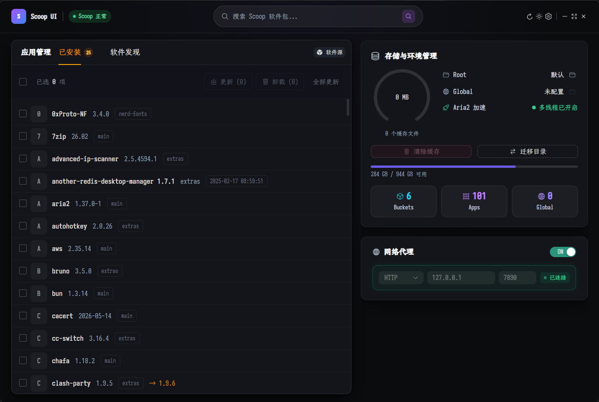
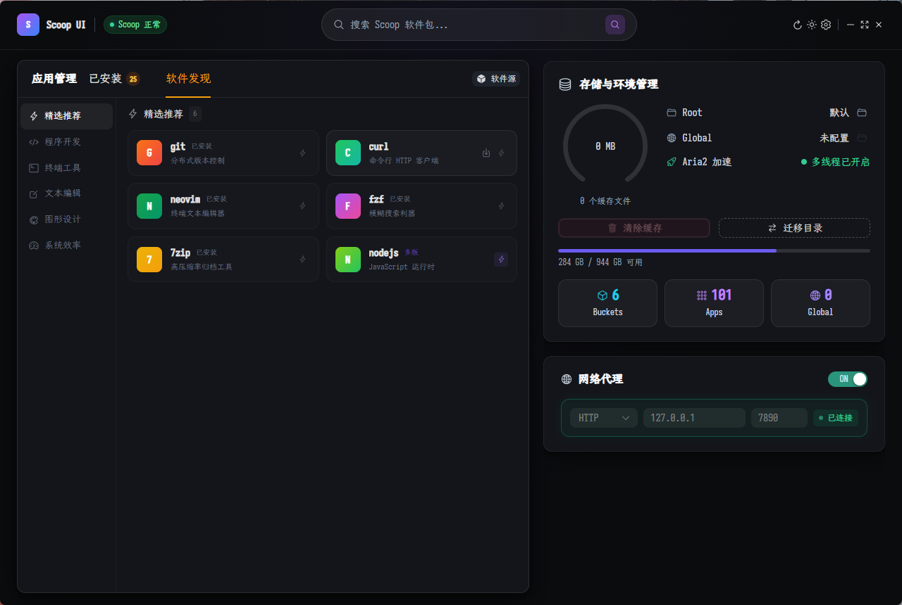
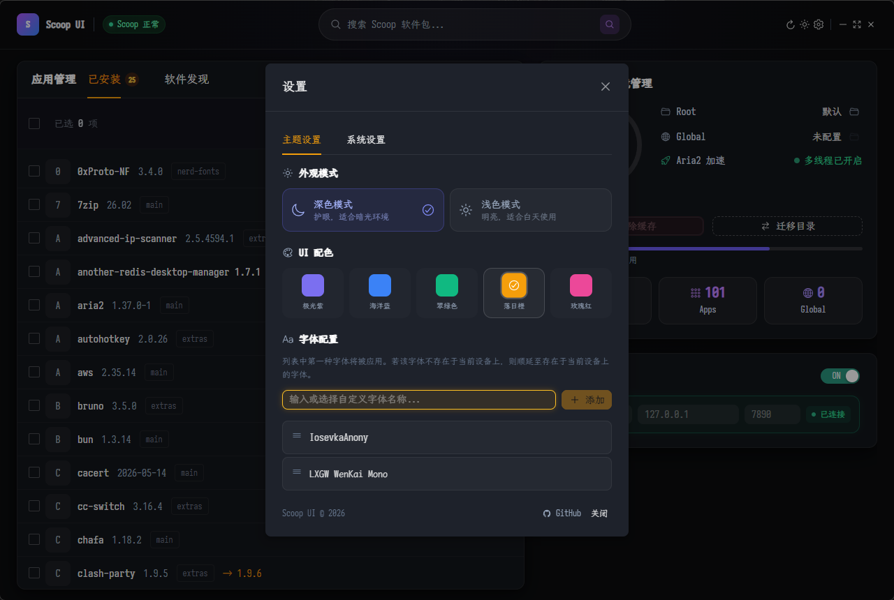

# Scoop UI

A modern GUI for the [Scoop](https://scoop.sh) package manager on Windows, built with Electron and Vue 3.

## Tech Stack

- **Frontend**: Vue 3 (Composition API) + TypeScript + Tailwind CSS + Naive UI + Pinia
- **Backend**: Electron Main Process + PowerShell (child_process.spawn)
- **Design**: Windows 11 Mica / Acrylic + Bento Box Layout

## Features

- Environment detection & one-click Scoop installation
- Search, install, uninstall, and update packages
- Real-time progress tracking with progress bars
- Cache management with visual dashboard
- Proxy configuration (HTTP / SOCKS5)
- Scoop directory migration
- Windows 11 Mica blur effect & Fluent Design
- Dark / Light theme support

## Development

```bash
# Install dependencies
npm install

# Run frontend dev server
npm run dev

# Build and run in Electron
npm run electron:dev

# Build for production
npm run electron:build
```

## Screenshots

|                                         |                                   |
+:========================================|:==================================+
|  |  |
|    |                                   |

## Project Structure

```
src/
├── main/                    # Electron main process
│   ├── index.ts             # Window creation, Mica, IPC registration
│   ├── ipc/
│   │   ├── scoop.ts         # Scoop command IPC handlers
│   │   └── config.ts        # Config read/write IPC
│   └── utils/
│       ├── config.ts        # ~/.scoop-ui/config.json CRUD
│       ├── config.default.json
│       └── powershell.ts    # PowerShell wrapper (GBK→UTF-8)
├── preload/
│   └── index.ts             # contextBridge → window.scoopAPI
└── renderer/                # Vue 3 app
    └── src/
        ├── App.vue          # Root component, theme provider
        ├── main.ts
        ├── components/      # ~18 components
        ├── stores/          # Pinia (app, packages, settings)
        ├── composables/
        ├── types/
        └── assets/
            └── main.css
```

## License

MIT
